# Reporte de Pruebas API: Adquisición de Equipamiento Híbrida

Este documento contiene el registro de las **10 pruebas** realizadas a la API del Hospital 230260. El objetivo de estas pruebas es verificar el correcto funcionamiento del Stored Procedure y la inserción de documentos en la base de datos híbrida (MySQL + MongoDB).

> [!NOTE]
> **Evidencia Fotográfica:** A continuación se muestran las capturas de la base de datos **antes de iniciar las pruebas** y **después** de concluir las 10 inserciones para comprobar el aumento de volumen en MySQL y MongoDB.

### Estado Inicial (Antes)
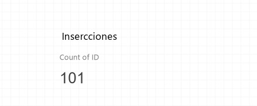

### Estado Final (Después)
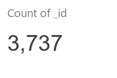
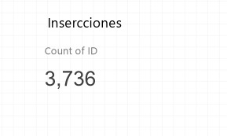

---

## Resumen de Ejecución

| Prueba | Objetivo | Cantidad | Resultado Esperado |
| :--- | :--- | :--- | :--- |
| **01** | Registro base aleatorio | 1 | (Usa funciones aleatorias) |
| **02** | Datos específicos (Manual) | 1 | (Valores fijos de Philips) |
| **03** | Volumen bajo | 10 | (10 registros variados) |
| **04** | Prueba de Devolución | 5 | (Tipo: 'Devolucion') |
| **05** | Ubicación específica | 3 | (Todo en Espacio ID: 1) |
| **06** | Volumen medio | 100 | (Carga rápida) |
| **07** | Límite de primer lote | 1,000 | (Dispara el primer COMMIT) |
| **08** | Stress / Multi-lote | 2,500 | (Tres bloques de guardado) |
| **09** | Error de Validación | 0 | Fallo controlado (Error: cantidad < 1) |
| **10** | Especialidad médica | 15 | (Equipamiento de imagenología) |

---

## Detalle de las 10 Pruebas

A continuación se detalla el payload (formato JSON) enviado en cada una de las peticiones a la API:

#### 01. Registro Aleatorio Simple
* **Propósito:** Verificar que las funciones `fn_random` de la base de datos funcionan de manera correcta si no se mandan datos.
```json
{ 
  "cantidad": 1, 
  "equipamiento": null, 
  "proveedor": null, 
  "specs": null, 
  "transaccion": null 
}
```
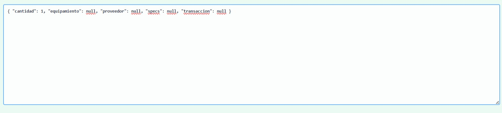
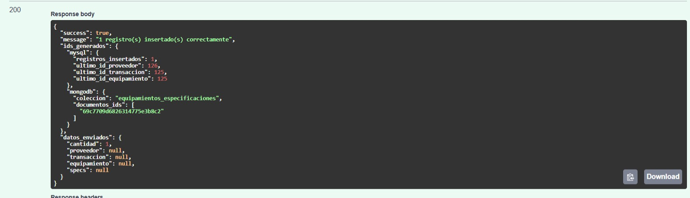

#### 02. Datos Manuales
* **Propósito:** Validar que la API y la base de datos respetan y guardan los datos específicos enviados en lugar de generar aleatorios.
```json
{
  "cantidad": 1,
  "equipamiento": { "espacio_id": 1, "marca": "Philips", "nombre": "Monitor de signos" },
  "proveedor": { "nombre": "MedEquip SA de CV", "id_persona": 1 },
  "specs": { "fabricante": "Philips Medical", "garantia_meses": 24 }
}
```
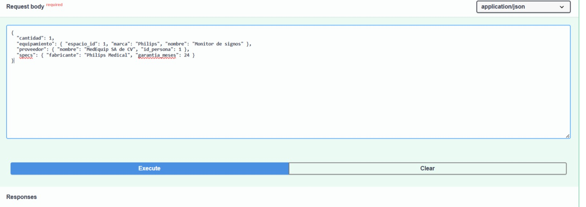
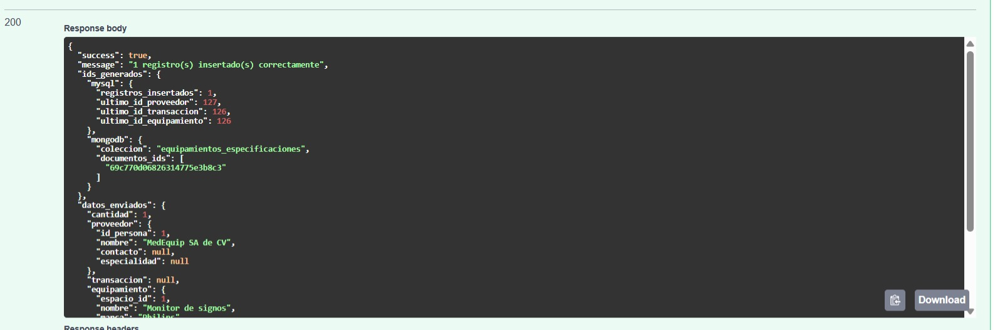

#### 03. Carga de 10 Equipos Variados
* **Propósito:** Ver la distribución de marcas y nombres aleatorios generados en una lista pequeña.
```json
{ 
  "cantidad": 10, 
  "equipamiento": null, 
  "proveedor": null, 
  "specs": null, 
  "transaccion": null 
}
```
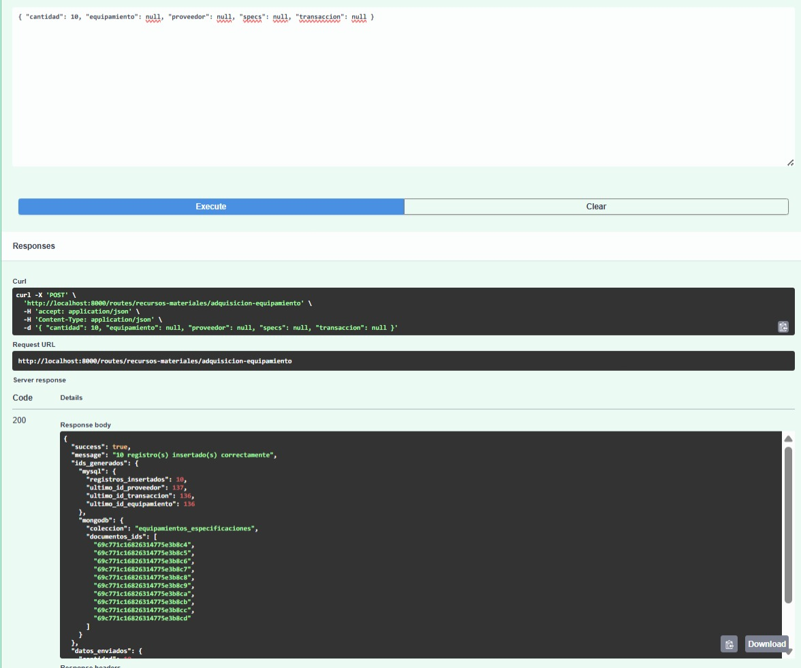

#### 04. Movimientos de Devolución
* **Propósito:** Probar un tipo de transacción específico y asegurar que se registre correctamente en la tabla `tbb_Transacciones_Financieras`.
```json
{
  "cantidad": 5,
  "transaccion": { "tipo_transaccion": "Devolucion" }
}
```
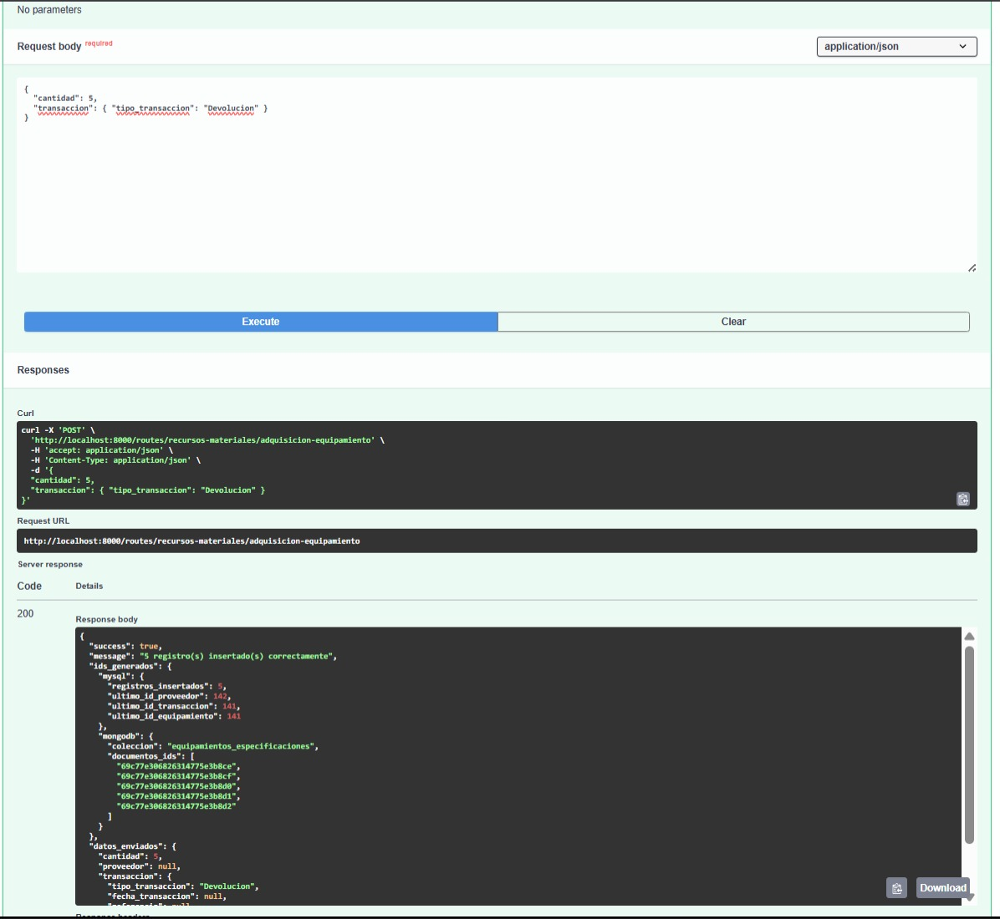

#### 05. Equipando un Consultorio Específico
* **Propósito:** Asegurar que el `espacio_id` enviado por el usuario sea asignado forzosa y correctamente a todos los equipamientos generados.
```json
{
  "cantidad": 3,
  "equipamiento": { "espacio_id": 1 }
}
```
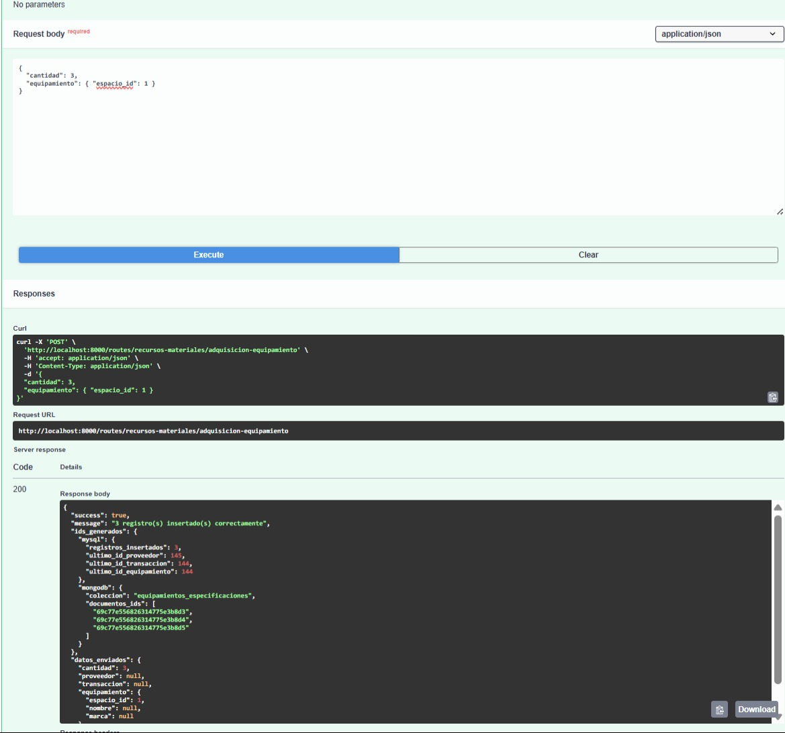

#### 06. Carga de 100 Registros
* **Propósito:** Medir el tiempo de respuesta y comportamiento ante una carga de volumen moderado.
```json
{ 
  "cantidad": 100, 
  "equipamiento": null, 
  "proveedor": null, 
  "specs": null, 
  "transaccion": null 
}
```


#### 07. Prueba de Lote (1,000 registros)
* **Propósito:** Forzar la ejecución del primer bloque de `COMMIT` programado dentro del Stored Procedure de la base de datos.
```json
{ 
  "cantidad": 1000, 
  "equipamiento": null, 
  "proveedor": null, 
  "specs": null, 
  "transaccion": null 
}
```
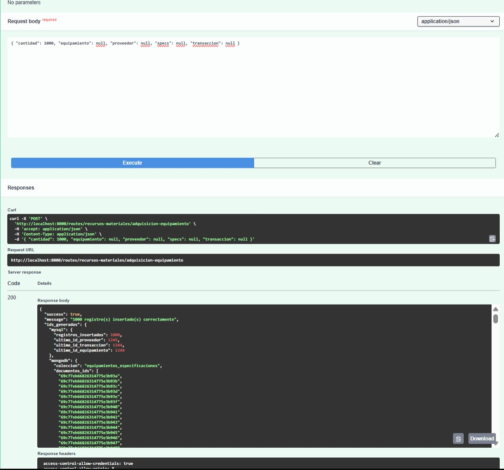

#### 08. Prueba de Estrés Máximo (2,500 registros)
* **Propósito:** Validar el comportamiento del servidor, API y Stored Procedure cuando debe procesar múltiples transacciones pesadas y generar miles de documentos en MongoDB simultáneamente.
```json
{ 
  "cantidad": 2500, 
  "equipamiento": null, 
  "proveedor": null, 
  "specs": null, 
  "transaccion": null 
}
```
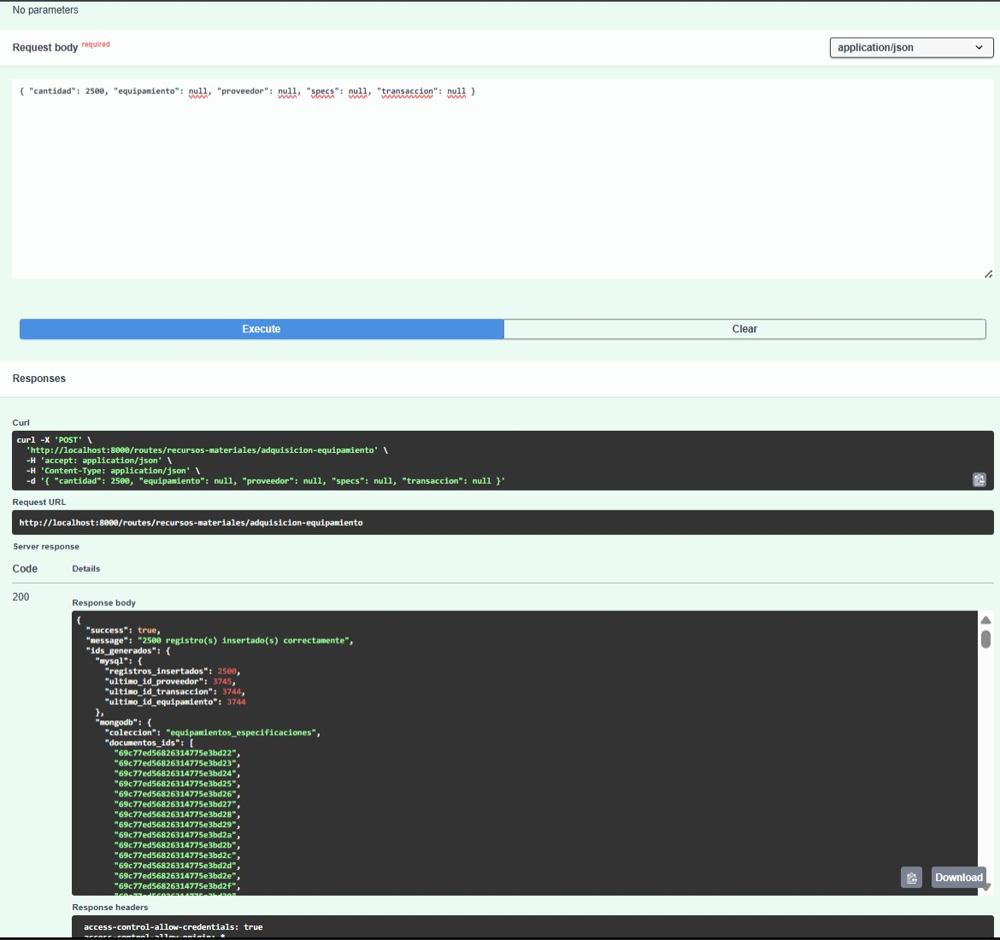

#### 09. Validación de Cantidad Negativa (Error Esperado)
* **Propósito:** Confirmar que la validación `SIGNAL SQLSTATE '45000'` configurada en el SP, detiene correctamente y con seguridad la ejecución al enviar `0` de cantidad.
```json
{ 
  "cantidad": 0, 
  "equipamiento": null, 
  "proveedor": null, 
  "specs": null, 
  "transaccion": null 
}
```
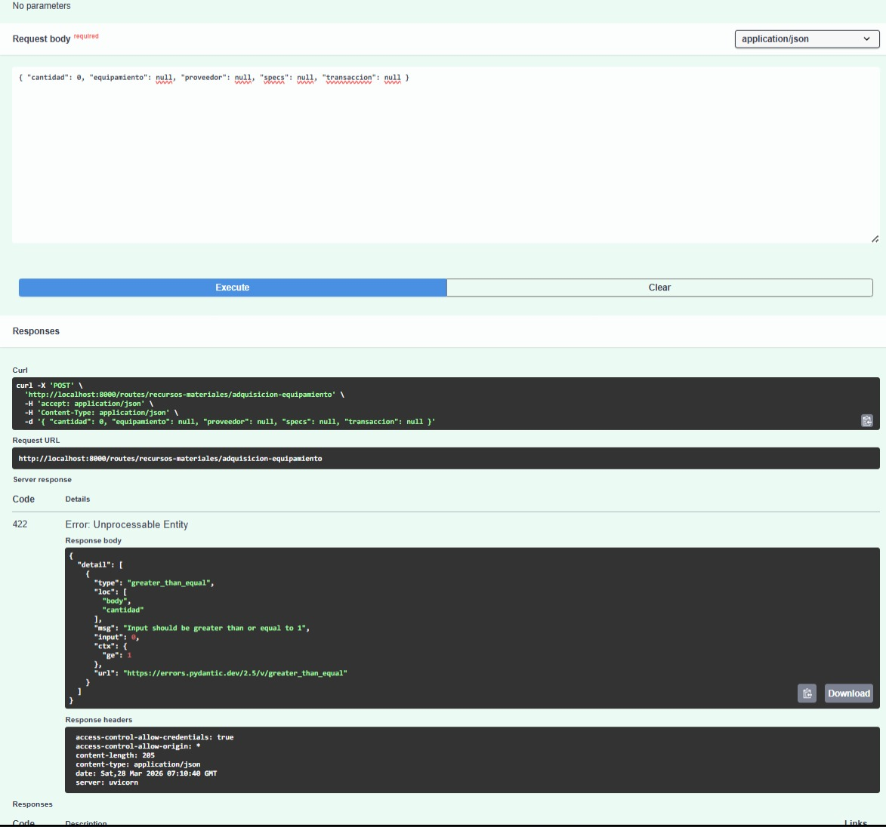

#### 10. Proveedores Especializados
* **Propósito:** Forzar de manera íntegra que los 15 registros tengan una especialidad específica e idéntica.
```json
{
  "cantidad": 15,
  "proveedor": { "especialidad": "Equipamiento de imagenologia" }
}
```
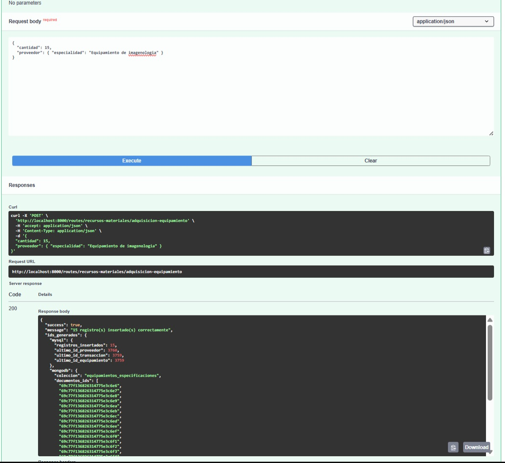
