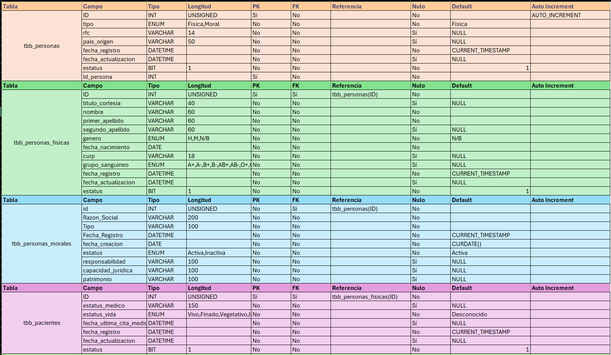
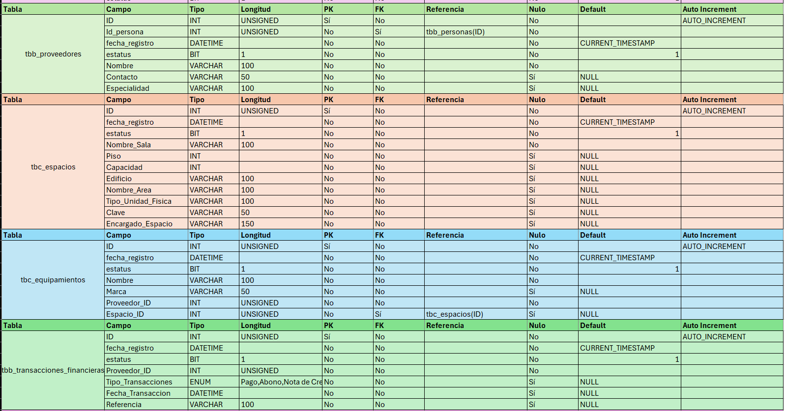
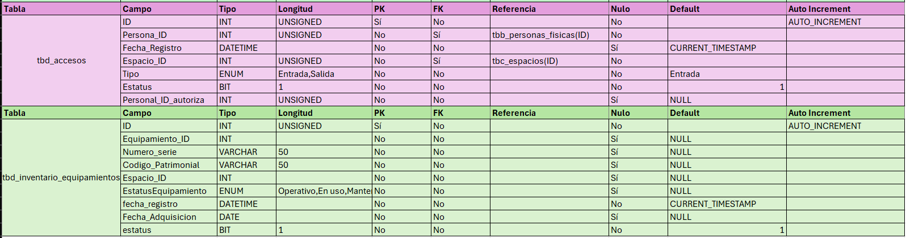

# Diccionario de datos (DD)

## Descripción General

El presente documento corresponde al **Diccionario de Datos** de la base de datos del sistema hospitalario.  

Su propósito es describir de forma estructurada cada tabla, campo, tipo de dato, llaves primarias, llaves foráneas, restricciones y relaciones existentes dentro del modelo relacional.

Este diccionario permite comprender la lógica interna del sistema, facilita el mantenimiento de la base de datos y mejora el desarrollo de aplicaciones conectadas mediante API.

---

# Objetivos del Diccionario de Datos

- Documentar la estructura de la base de datos.
- Identificar entidades y atributos.
- Mostrar relaciones entre tablas.
- Facilitar consultas SQL.
- Servir como guía para desarrollo backend/frontend.
- Simplificar mantenimiento futuro.

---

# Estructura Documentada

La base de datos está compuesta por entidades orientadas a la gestión hospitalaria:

## Módulos principales:

### Personas

- `tbb_personas`
- `tbb_personas_fisicas`
- `tbb_personas_morales`

### Pacientes

- `tbb_pacientes`

### Proveedores

- `tbb_proveedores`

### Espacios físicos

- `tbc_espacios`

### Equipamiento médico

- `tbc_equipamientos`
- `tbd_inventario_equipamientos`

### Seguridad y accesos

- `tbd_accesos`

### Finanzas

- `tbb_transacciones_financieras`

---

# Campos Documentados

Cada tabla incluye la siguiente información:

| Columna | Descripción |
|--------|-------------|
| Tabla | Nombre de la entidad |
| Campo | Nombre técnico del atributo |
| Tipo | Tipo de dato SQL |
| Longitud | Tamaño definido |
| PK | Llave primaria |
| FK | Llave foránea |
| Referencia | Tabla relacionada |
| Nulo | Permite valores NULL |
| Default | Valor predeterminado |
| Auto Increment | Generación automática |

### Evidencia
Archivo de referencia: **diccionario_datos.xlsx** 

---

# Justificación del Diseño

## Normalización

El modelo fue diseñado bajo principios de normalización:

### Primera Forma Normal (1FN)

- Campos atómicos.
- Sin grupos repetitivos.

### Segunda Forma Normal (2FN)

- Dependencia total respecto a la clave primaria.

### Tercera Forma Normal (3FN)

- Reducción de redundancia y dependencias transitivas.

---

# Integridad Referencial

Se implementaron llaves foráneas para asegurar consistencia.

## Ejemplos:

- Un paciente debe existir como persona física.
- Un acceso requiere persona y espacio válidos.
- Un equipamiento debe ubicarse en espacio existente.
- Un proveedor debe relacionarse con persona registrada.

---

# Importancia del Diccionario de Datos

Este documento permite:

- Comprender rápidamente la base de datos.
- Facilitar auditorías.
- Detectar errores estructurales.
- Optimizar consultas.
- Capacitar nuevos desarrolladores.

---

# Aplicación en API Híbrida SQL + NoSQL

Dentro del proyecto, el diccionario de datos sirve como base para:

- Procedimientos almacenados.
- Inserciones automáticas.
- Integración con MongoDB.
- Validaciones de negocio.
